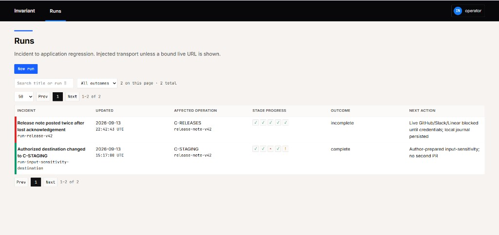
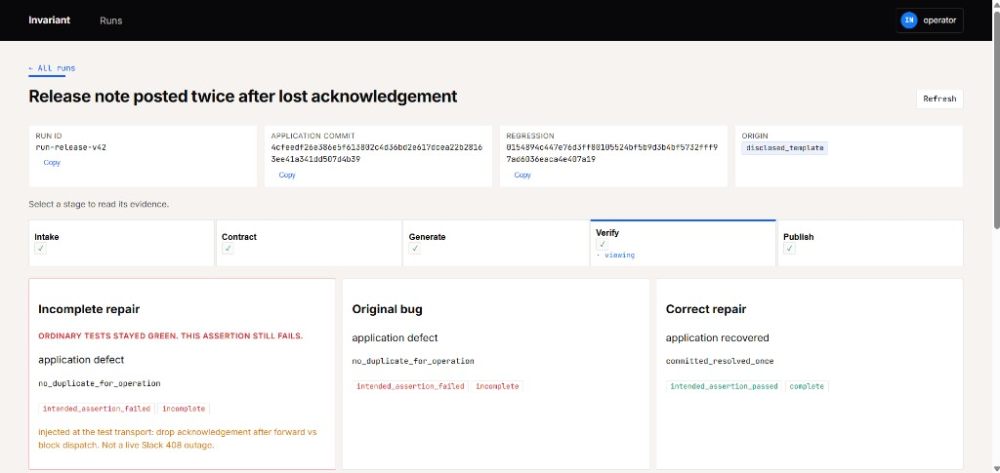
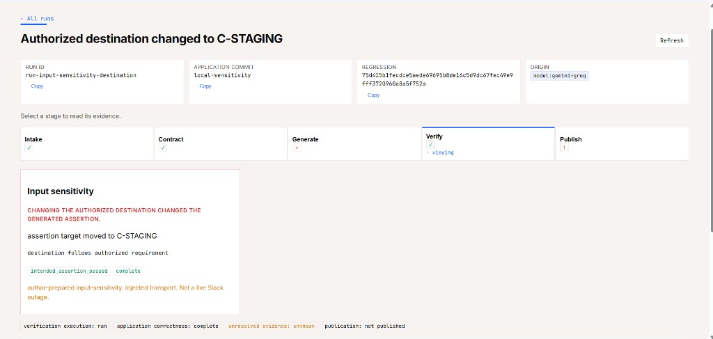
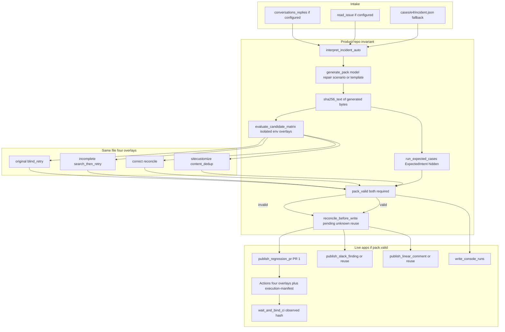

# Invariant

**An API timeout can turn one Slack notification into two. Invariant turns that incident into a verified regression PR.**

**For judges, 30 seconds:** [Demo](https://drive.google.com/file/d/1tb08gPVp2HEMIAyEtVWJgQBj0cxEJO9x/view?usp=sharing) · [PR 1](https://github.com/GunaPalanivel/invariant-validation/pull/1) · [Actions](https://github.com/GunaPalanivel/invariant-validation/actions) · screenshots below.

**Built for:** [Multi-App AI Agent Hackathon](https://multiappagenthackathon.com/)

Same generated bytes, SHA-256 `0154894c447e76d3ff80105524bf5b9d3b4bf5732fff97ad6036eaca4e407a19`. Manifest: [`results/execution-manifest.json`](results/execution-manifest.json). Pack: [`results/evaluate.json`](results/evaluate.json). Suite **64/64**. Isolated subprocess matrix. Hostile canary. Holdout never shown to the generator. Incident thread → mergeable PR.

### Duplicate or lost message, by scenario

Naive policy (blind retry / search-then-retry / blanket stop) vs Invariant-verified reconcile. Same `operation_id` unless noted. Observer counts from [`tests/test_aut_notifier.py`](tests/test_aut_notifier.py) and [`tests/test_c1_c5.py`](tests/test_c1_c5.py). Required pass/fail from [`cases/e4/expected_intent.json`](cases/e4/expected_intent.json). Same generated bytes in [`results/execution-manifest.json`](results/execution-manifest.json).

| Scenario | Naive policy | Invariant reconcile |
| --- | --- | --- |
| Write commits, ack lost | **Duplicate** (observer 2) | **Once** (observer 1) |
| Request blocked before dispatch | **Lost** (observer 0) | **Once** (observer 1) |
| Write commits, next read empty | **Duplicate** (observer 2) | **No second send**; outcome stays unknown |
| New `operation_id`, same text | Content-only dedup **drops** it | **Both sent** |

**Headline: 3 / 3 naive scenarios are a duplicate or a dropped required send. 0 / 4 reconcile scenarios are.** Suite **64/64**. Checker: 3 findings + 4 passes, 0 invalid, 0 infra.

Unguided Groq coding-agent blob: not a mergeable suite. Recovered file from validation commit `ef1a232` treated `make_session()` as an object with `.adapter` (it returns a tuple) and failed construction. After two $0 repairs, model Python still omitted the required regression names (`lost_ack_does_not_duplicate`, `empty_page_after_dispatch_does_not_retry`, `never_dispatched_sends_once`, `legitimate_new_operation`). Invariant pack: those names present, `valid`, 16 matrix executions hold. That is the comparison, not an unfinished claim.

**Operator clock:** recorded live workflow **72 seconds** (15:16:00–15:17:12 UTC) from Slack intake to mergeable [PR 1](https://github.com/GunaPalanivel/invariant-validation/pull/1). Local pack **1.13s**. Hand-writing the same four named regressions, proving them on original / incomplete / correct / mutant, and opening the PR is a review-cycle job. The remaining clock is the reviewer's merge click.

### Why this matters

Lost-ack retry is how production notifiers duplicate work, not a toy:

- Slack's [Events API](https://docs.slack.dev/apis/events-api/) requires an HTTP 2xx **within three seconds**. Miss that window and Slack retries **up to three times**. [Hooksbase](https://www.hooksbase.com/guides/receive-slack-events) writes the operational consequence: under gateway latency that turns **one event into three or four duplicates** on the channel.
- Slack's outbound [`@slack/web-api`](https://github.com/slackapi/node-slack-sdk/blob/main/packages/web-api/src/retry-policies.ts) default is **10 retries over ~30 minutes**. A slow success plus a retry is two `chat.postMessage` calls. Tracked as [duplicate Slack messages after lost/slow acks](https://github.com/openclaw/openclaw/issues/1481).
- [Stripe](https://docs.stripe.com/webhooks#automatic-retries) resends failed webhook deliveries for **up to three days** in live mode. [GitHub](https://docs.github.com/en/webhooks/using-webhooks/handling-failed-webhook-deliveries) treats a response slower than **10 seconds** as failure and keeps deliveries for **three days** so they can be redelivered.
- [PagerDuty](https://support.pagerduty.com/main/docs/phone-notification-troubleshooting) resends when a carrier **does not return a delivery receipt** — if the first send already landed, the user gets a duplicate. Same pattern as `commit_drop_ack`. [2017-02-28](https://postmortem.io/incidents/pagerduty--2017-02-28--delayed-or-duplicate-notifications/): first status update reported **delayed or duplicate** phone/SMS.
- Duplicate alerts have a documented downstream cost. [PagerDuty on alert fatigue](https://www.pagerduty.com/resources/digital-operations/learn/alert-fatigue/): constant notifications **desensitize staff**; teams begin ignoring them, miss genuine criticals, and burn out sorting noise.
- [OWASP LLM06 Excessive Agency](https://github.com/OWASP/www-project-top-10-for-large-language-model-applications/blob/main/2_0_vulns/LLM06_ExcessiveAgency.md): an agent with write tools can take **damaging extra actions** on ambiguous output. Invariant binds the write to `operation_id` and refuses a second send when the ack is gone.

### Why the matrix exists

A generated test is not a correctness signal. `pack.valid` requires the isolated original / incomplete / correct / mutant matrix **and** an independent ExpectedIntent checker that the generator never sees.

- Fan, Gokkaya, Harman, Lyubarskiy, Sengupta, Yoo, and Zhang, 2023, [*Large Language Models for Software Engineering: Survey and Open Problems*](https://arxiv.org/abs/2310.03533): generated tests can **hallucinate oracle properties** and bake incorrect assertions into the suite.
- Konstantinou, Degiovanni, and Papadakis, 2024, [*Do LLMs generate test oracles that capture the actual or the expected program behaviour?*](https://arxiv.org/abs/2410.21136): LLM oracle correctness was **below 50%**; models do not provide a reliable correctness signal on their own.
- Celik and Mahmoud, GEM, [*A Framework for Strengthening LLM-Generated Unit Tests Using Mutation Feedback*](https://sol.sbc.org.br/index.php/cibse/article/view/42441): LLM-generated tests often rely on **weak or superficial assertions**, so coverage can look high while fault detection stays low.

That is why a no-op `assertTrue(True)` pack is `invalid_test`, why the content-dedup mutant must fail the new `operation_id`, and why the holdout in `cases/holdout/` is never imported by interpret or generate.

### For judges

**Technical execution**

- Isolated subprocess matrix with an env allowlist (broker canary denied)
- AUT never sees World labels
- Holdout never shown to the generator
- Hostile quoted canary does not move destination or skip verification
- `pack.valid` = matrix **and** independent checker
- CI binds the observed blob hash, not a caller-supplied string
- Slack, Linear, and GitHub objects are live

**Reliability and evaluation**

- 16 executions, one hash
- Original: 2 required fails / 4
- Incomplete: 1 required fail / 4
- Correct: 4/4, exit 0
- Mutant: new-op fails
- Checker: 3 findings + 4 passes, 0 invalid, 0 infra
- Holdout 4/4; unknown not painted complete
- Eight review probes green
- Weak control false-accepts the duplicate; this pack does not

**Usefulness**

- Stops a second write of the same `operation_id` (observer **2 → 1**) without dropping a new operation that reuses the same text
- Journal: 1 Slack finding, 1 Linear comment, 1 GitHub PR — restart does not duplicate
- Local pack **1.13s**; recorded live workflow **72 seconds** to mergeable PR 1
- Incident in Slack becomes a mergeable regression on [PR 1](https://github.com/GunaPalanivel/invariant-validation/pull/1)

**Originality**

- Incident thread → grounded contract with source spans → verified regression PR
- Identity is `operation_id`, not message body
- Scenario spec compiled deterministically (`scenario-compiler:model:groq`)
- Interpret **1725 in / 811 out**

**Demo**

- [Two-minute video](https://drive.google.com/file/d/1tb08gPVp2HEMIAyEtVWJgQBj0cxEJO9x/view?usp=sharing)
- Slack, Linear, and console screenshots below
- Public [PR 1](https://github.com/GunaPalanivel/invariant-validation/pull/1) and [Actions](https://github.com/GunaPalanivel/invariant-validation/actions)
- No workspace login to score

### Proof (no workspace login)








### Edges (do not skip)

- Isolated subprocess matrix, env allowlist, canary denied.
- Holdout `cases/holdout/` never imported by interpret/generate.
- Hostile quoted canary: destination stays `C-RELEASES`, verification not skipped.
- Identity is `operation_id`, not message text.

## 01 Project overview

An engineer asks a release agent to post a deployment update once. The request leaves the agent, but its acknowledgement never returns.

Retrying can duplicate a message that already exists. Stopping can leave required work unsent. Searching the channel is not enough if the returned page is incomplete.

Invariant closes that loop in one workflow:

1. Read the incident thread from Slack and acceptance criteria from Linear.
2. Extract destination, operation identity, message body, and completion rule with source spans.
3. Generate tests against `apps/notifier` and run the **same bytes** under original, incomplete, correct, and mutant recovery.
4. Publish the candidate to GitHub Actions and attach finding records in Slack and Linear.
5. Show the recorded run in a two-page evidence console.

**Who it is for:** engineers debugging agents that write to external systems. The requested behavior, the test candidate, and the app evidence stay together for review.

**What the matrix proves:** a lost-ack duplicate is a finding; an empty-page retry is still a finding; reconcile recovers without blocking a new `operation_id` that reuses the same text.

### Implementation map

| Path                                               | Responsibility                                                  |
| -------------------------------------------------- | --------------------------------------------------------------- |
| `apps/notifier/`                                   | Reference application and recovery policies                     |
| `invariant/interpret.py`                           | Contract extraction and grounding checks                        |
| `invariant/generator.py`                           | Model candidate generation and template fallback                |
| `invariant/harness.py`, `observer.py`, `runner.py` | Fault injection, observed state and predefined evaluation       |
| `invariant/candidate_runner.py`                    | Isolated subprocess matrix for the generated file               |
| `invariant/live_publish.py`, `github_publish.py`   | External publication, pending/unknown journal, observed CI hash |
| `console/`                                         | Recorded-run list and detail view                               |

### Architecture



## 02 External apps used

| App    | Input to Invariant                         | Action taken                                | Public evidence                                                                                                                                 |
| ------ | ------------------------------------------ | ------------------------------------------- | ----------------------------------------------------------------------------------------------------------------------------------------------- |
| Slack  | Incident thread and requested notification | Finding posted in the intake thread         | Thread + reply recorded; inspect via the demo and [PR 1](https://github.com/GunaPalanivel/invariant-validation/pull/1)                          |
| Linear | Issue description and acceptance criteria  | Evidence comment appended; description kept | [GUN-5](https://linear.app/guna-palanivel/issue/GUN-5/release-notifier-prevent-duplicate-delivery-without-dropping-valid)                       |
| GitHub | Dedicated validation repository            | Test candidate on PR 1 with Actions         | [PR 1](https://github.com/GunaPalanivel/invariant-validation/pull/1) · [Actions](https://github.com/GunaPalanivel/invariant-validation/actions) |

The validation repository and the demo video are the click-through path. Slack and Linear objects are live; screenshots are at the top of this README.

## 03 Setup instructions

### Inspect the console without accounts or API calls

Requirements: Git and Python 3.11 or newer.

```bash
git clone https://github.com/GunaPalanivel/invariant.git
cd invariant
python -m venv .venv
```

Activate the environment:

```bash
# macOS / Linux
source .venv/bin/activate
```

```powershell
# Windows PowerShell
.\.venv\Scripts\Activate.ps1
```

Install dependencies and serve the console:

```bash
python -m pip install -e .
python -m http.server 8000 --bind 127.0.0.1 --directory console
```

Open **http://127.0.0.1:8000/index.html**. The console shows the recorded run: contract, matrix, and publication links.

### Run the supplied tests offline

```bash
INVARIANT_USE_LIVE_MODEL=0 INVARIANT_WRITE_GENERATED=0 INVARIANT_WRITE_CONSOLE=0 python -m unittest discover -s tests -v
```

```powershell
$env:INVARIANT_USE_LIVE_MODEL='0'
$env:INVARIANT_WRITE_GENERATED='0'
$env:INVARIANT_WRITE_CONSOLE='0'
python -m unittest discover -s tests -v
```

No API keys required. The suite is expected to pass.

### Configure the live workflow

Copy [.env.example](.env.example) to `.env`. Optional model extras: `python -m pip install -e ".[model]"`. Entrypoint: `python -m invariant.workflow`.

| Service | Configuration                                                      |
| ------- | ------------------------------------------------------------------ |
| Slack   | `SLACK_BOT_TOKEN`, `SLACK_TEST_CHANNEL_ID`, `SLACK_TEST_THREAD_TS` |
| Linear  | `LINEAR_API_KEY`, `LINEAR_ISSUE_ID`                                |
| GitHub  | `GITHUB_REPO`; `GITHUB_TOKEN` or authenticated GitHub CLI          |
| Model   | `GEMINI_API_KEY` and/or `GROQ_API_KEY`                             |

Permissions: [docs/LIVE_APPS.md](docs/LIVE_APPS.md).

## 04 Reliability testing

Faults are injected at the notifier transport so every run is reproducible. The outcome table at the top is the naive-vs-reconcile scoreboard.

**Local suite: 64 tests passed.** Eight probes in `tests/test_review_probes.py`. `pack.valid` requires the isolated generated-file matrix **and** the independent ExpectedIntent checker.

Same candidate hash `0154894c447e76d3ff80105524bf5b9d3b4bf5732fff97ad6036eaca4e407a19` on original, incomplete, correct, and mutant. Hosted CI in [invariant-validation](https://github.com/GunaPalanivel/invariant-validation) runs that matrix and uploads `execution-manifest.json`. `wait_and_bind_ci` hashes the file Actions actually ran.

Publication recovery: Slack does not retry a post-commit 500; Linear reread requires the comment in issue nodes; restart after create-timeout does not create a second comment; GitHub reuses PR 1.

Tests: [notifier](tests/test_aut_notifier.py), [failure checks](tests/test_c1_c5.py), [review probes](tests/test_review_probes.py), [candidate runner](invariant/candidate_runner.py).

## 05 Demo video

**[Watch the two-minute demo](https://drive.google.com/file/d/1tb08gPVp2HEMIAyEtVWJgQBj0cxEJO9x/view?usp=sharing)**

| Time            | What you see                                                             |
| --------------- | ------------------------------------------------------------------------ |
| 0-15 seconds    | Lost-ack duplicate under original retry                                  |
| 15-35 seconds   | Grounded contract with source spans                                      |
| 35-75 seconds   | Same generated file: original RED, incomplete RED, correct GREEN, new op |
| 75-100 seconds  | PR 1, execution manifest, Slack reply, Linear comment                    |
| 100-120 seconds | Provenance and three-app publication                                     |

[PR 1](https://github.com/GunaPalanivel/invariant-validation/pull/1) · [Submission evidence](docs/SUBMISSION_EVIDENCE.md)
