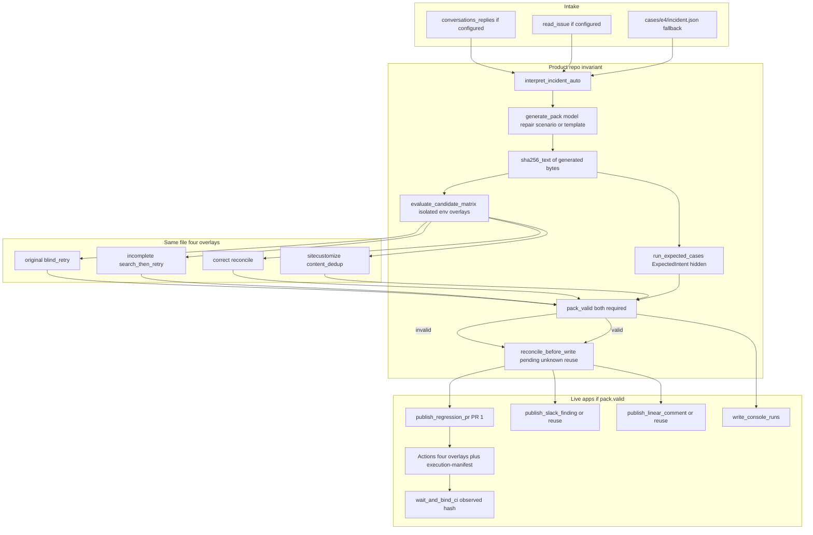

# Invariant

**An API timeout can turn one Slack notification into two.**

Invariant connects Slack, Linear and GitHub to investigate ambiguous delivery and assemble a reviewable test PR for a reference release notifier. The engineering question: does a retry fix prevent duplicates while preserving legitimate work?

**Built for:** [Multi-App AI Agent Hackathon](https://multiappagenthackathon.com/)

[Inspect the test PR](https://github.com/GunaPalanivel/invariant-validation/pull/1) | [Recorded evidence](docs/SUBMISSION_EVIDENCE.md) | [Run locally](#03-setup-instructions) | [Reliability testing](#04-reliability-testing) | [Demo](#05-demo-video)

**Demo video:** [Multi_App_Hackathon_Strategy.mp4](https://drive.google.com/file/d/1tb08gPVp2HEMIAyEtVWJgQBj0cxEJO9x/view?usp=sharing). The [recording guide](docs/DEMO.md) describes the two-minute walkthrough.

**Current build:** live model-assisted interpretation, a Groq scenario spec compiled into the generated suite, isolated original/incomplete/correct/mutant execution, and recorded publications in all three apps. Failure reproduction uses injected transport. Details: [`docs/GENERATION_DIAGNOSIS.md`](docs/GENERATION_DIAGNOSIS.md).

## 01 Project overview

An engineer asks a release agent to post a deployment update once. The request leaves the agent, but its acknowledgement never returns.

Retrying can duplicate a message that already exists. Stopping can leave required work unsent. Searching the channel is not enough if the returned page is incomplete.

Invariant brings the incident, intended behavior, test candidate and publication evidence into one workflow:

1. Read the incident thread from Slack and acceptance criteria from Linear.
2. Use a live model to extract the destination, operation identity, message body and completion rule.
3. Assemble tests against the bundled Python notifier and evaluate its recovery policies under controlled faults.
4. Publish the test candidate to GitHub and attach finding records in Slack and Linear.
5. Present the recorded run in a two-page evidence console with links to the external artifacts.

The supported application is `apps/notifier`. This version uses its local source; it does not investigate arbitrary GitHub repositories.

**Who it is for:** engineers debugging agents that write to external systems. The workflow keeps the requested behavior, test candidate and app evidence together for review.

**Technical focus:** an incomplete retry repair can still duplicate work when its state query is inconclusive. The local harness makes that failure visible alongside correct recovery. A general advantage over other coding agents remains unmeasured.

### Implementation map

| Path                                               | Responsibility                                                  |
| -------------------------------------------------- | --------------------------------------------------------------- |
| `apps/notifier/`                                   | Reference application and recovery policies                     |
| `invariant/interpret.py`                           | Contract extraction and grounding checks                        |
| `invariant/generator.py`                           | Model candidate generation and template fallback                |
| `invariant/harness.py`, `observer.py`, `runner.py` | Fault injection, observed state and predefined evaluation       |
| `invariant/candidate_runner.py`                    | Isolated subprocess matrix for the generated file               |
| `invariant/live_publish.py`, `github_publish.py`   | External publication, pending/unknown journal, observed CI hash |
| `console/`                                         | Recorded-run list and detail view                               |

### Architecture

Product path from the current modules. Faults are injected at the test transport.



## 02 External apps used

| App    | Input to Invariant                                    | Action taken                                            | Evidence                                                                                                                  |
| ------ | ----------------------------------------------------- | ------------------------------------------------------- | ------------------------------------------------------------------------------------------------------------------------- |
| Slack  | Incident thread and requested notification            | Post a finding in the thread                            | [Recorded incident](https://invariantlab.slack.com/archives/C0C1H02UHEW/p1789306404361089)                                |
| Linear | Issue description and acceptance criteria             | Append an evidence comment                              | [GUN-5](https://linear.app/guna-palanivel/issue/GUN-5/release-notifier-prevent-duplicate-delivery-without-dropping-valid) |
| GitHub | Dedicated validation repository and existing PR state | Publish the test candidate and associate an Actions run | [PR 1](https://github.com/GunaPalanivel/invariant-validation/pull/1)                                                      |

Slack and Linear links require workspace access. Public [run records](docs/SUBMISSION_EVIDENCE.md) and the [validation repository](https://github.com/GunaPalanivel/invariant-validation) provide an inspectable alternative. Run records describe what was observed in that run; they are not proof that every recovery path is correct.

## 03 Setup instructions

### Inspect the console without accounts or API calls

Requirements: Git and Python 3.11 or newer.

```bash
git clone https://github.com/GunaPalanivel/invariant.git
cd invariant
python -m venv .venv
```

Activate the environment:

```bash
# macOS / Linux
source .venv/bin/activate
```

```powershell
# Windows PowerShell
.\.venv\Scripts\Activate.ps1
```

Install dependencies and serve the console:

```bash
python -m pip install -e .
python -m http.server 8000 --bind 127.0.0.1 --directory console
```

Open **http://127.0.0.1:8000/index.html**. The console displays saved run records; opening it does not execute the agent or call external APIs.

### Run the supplied tests offline

In the activated environment, disable live model calls and run the suite:

```bash
INVARIANT_USE_LIVE_MODEL=0 INVARIANT_WRITE_GENERATED=0 INVARIANT_WRITE_CONSOLE=0 python -m unittest discover -s tests -v
```

```powershell
$env:INVARIANT_USE_LIVE_MODEL='0'
$env:INVARIANT_WRITE_GENERATED='0'
$env:INVARIANT_WRITE_CONSOLE='0'
python -m unittest discover -s tests -v
```

No API keys are required. Use a disposable checkout: some tests regenerate local result files. Review [the reliability limits](#what-the-evidence-does-and-does-not-establish) before interpreting a passing run.

### Configure the live workflow

The live workflow generates/executes Python and can write to the configured apps. Isolated candidate execution and publication recovery are covered by `tests/test_review_probes.py`. Use dedicated test destinations.

Its configuration uses a local `.env` copied from [.env.example](.env.example):

| Service | Configuration                                                      |
| ------- | ------------------------------------------------------------------ |
| Slack   | `SLACK_BOT_TOKEN`, `SLACK_TEST_CHANNEL_ID`, `SLACK_TEST_THREAD_TS` |
| Linear  | `LINEAR_API_KEY`, `LINEAR_ISSUE_ID`                                |
| GitHub  | `GITHUB_REPO`; `GITHUB_TOKEN` or authenticated GitHub CLI          |
| Model   | `GEMINI_API_KEY` and/or `GROQ_API_KEY`                             |

Install the optional clients with `python -m pip install -e ".[model]"`. The broker's workflow entrypoint is `python -m invariant.workflow`; it performs external writes. Use dedicated test destinations and locally stored credentials. The default validation destination belongs to this project; configure a repository you control for your own run.

The [adapter guide](docs/LIVE_APPS.md) lists service permissions and destinations. The offline walkthrough has no model API cost; live availability depends on the configured provider account and quota.

## 04 Reliability testing

We inject faults at the notifier's transport boundary and inspect resulting message state. The notifier receives ordinary send/read results; the observer records destination, operation identity, content and effect count.

| Controlled case                                 | Behavior checked                                      |
| ----------------------------------------------- | ----------------------------------------------------- |
| Write commits, acknowledgement is lost          | Blind retry produces a duplicate                      |
| Request is blocked before dispatch              | Blanket stopping leaves required work unsent          |
| Write commits, next read is truncated and empty | Search-then-retry produces a duplicate                |
| Existing write is confirmed present             | Reconciliation avoids a second send                   |
| Dispatch is known not to have happened          | Recovery completes the intended write                 |
| Dispatch happened, evidence remains incomplete  | Recovery reports unknown without resending            |
| Shared session, new `operation_id`, same text   | Correct recovery sends both; content-only dedup fails |

Local suite: **62 tests passed** with live models disabled, including eight desired-state probes for the review findings (`tests/test_review_probes.py`). The predefined checker still reports three intended defect detections and four passing cases. `pack.valid` is true only when that checker **and** the isolated generated-file matrix both hold.

Tests and implementation: [notifier tests](tests/test_aut_notifier.py), [failure checks](tests/test_c1_c5.py), [review probes](tests/test_review_probes.py), [observer](invariant/observer.py), [candidate runner](invariant/candidate_runner.py).

### What the evidence does and does not establish

- **Model provenance:** Groq produced a scenario spec after two $0 Python repairs failed the required test names. A deterministic compiler rendered the suite (`scenario-compiler:model:groq`). That is not free-form model-authored unittest. Hash `0154894c447e76d3ff80105524bf5b9d3b4bf5732fff97ad6036eaca4e407a19`.
- **Candidate verification:** the same generated bytes run in isolated processes against original, incomplete, correct, and a content-dedup mutant. No-op `assertTrue(True)` candidates are invalid. The ExpectedIntent runner is an independent checker and cannot alone set `pack.valid`.
- **Execution and grounding:** candidates run with an environment allowlist (synthetic canary denied). Mandatory contract fields need source spans that support the values; a judge cannot ground invented fields.
- **Publication:** Slack does not retry after a post-commit 500. Linear reread requires an observed comment. Restart after create-timeout does not create a second comment. CI binding hashes the remote file at `head_sha`.
- **Comparison:** capable-model comparison has not established superiority; customer time savings have not been measured. Independent engineer review of PR 1 and the two-minute video are still outstanding.

A green unit suite is not a production-readiness claim. See [GENERATION_DIAGNOSIS.md](docs/GENERATION_DIAGNOSIS.md), [BRIEF.md](BRIEF.md), and [submission evidence](docs/SUBMISSION_EVIDENCE.md).

## 05 Demo video

**Video link:** [Multi_App_Hackathon_Strategy.mp4](https://drive.google.com/file/d/1tb08gPVp2HEMIAyEtVWJgQBj0cxEJO9x/view?usp=sharing)

The walkthrough should make the completed behavior visible in this order:

| Time            | Evidence to show                                                           |
| --------------- | -------------------------------------------------------------------------- |
| 0-15 seconds    | Lost-ack duplicate under original retry                                    |
| 15-35 seconds   | Grounded contract with source spans                                        |
| 35-75 seconds   | Same generated file: original RED, incomplete RED, correct GREEN, new op   |
| 75-100 seconds  | PR 1, execution manifest, Slack reply, Linear comment                      |
| 100-120 seconds | Scenario-compiler provenance, `superiority_claim: false`, remaining limits |

The console is a recorded-run viewer. Label replayed evidence and injected failures.

[Recorded app evidence](docs/SUBMISSION_EVIDENCE.md) · [Recording guide](docs/DEMO.md)
