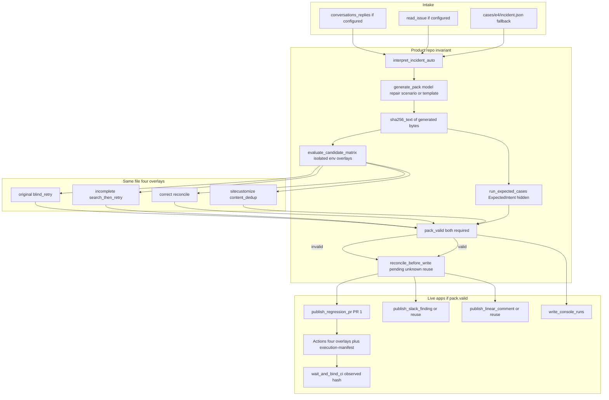
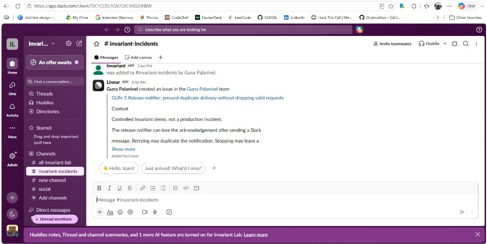
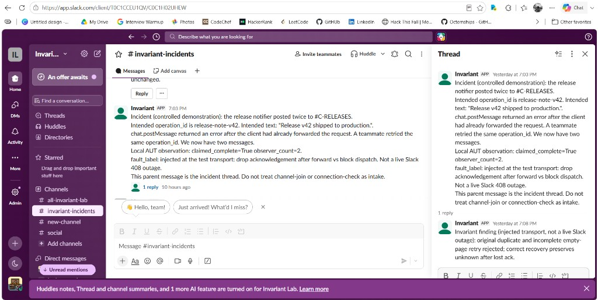
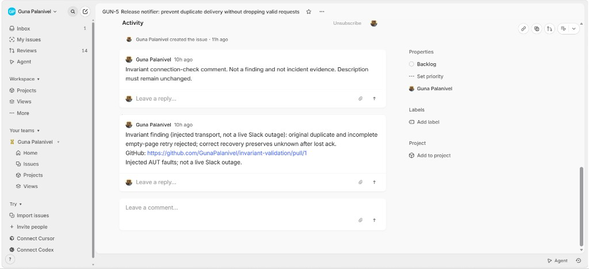

# Invariant

**An API timeout can turn one Slack notification into two. Invariant turns that incident into a verified regression PR.**

Invariant reads Slack and Linear, derives a grounded delivery contract, generates a regression against a release notifier, and proves the same generated file on four implementations: original fails, incomplete repair fails, correct recovery passes, content-only dedup fails. It then publishes that file to GitHub and records the finding in Slack and Linear.

**Built for:** [Multi-App AI Agent Hackathon](https://multiappagenthackathon.com/)

**Judge path (no login):** [Demo video](https://drive.google.com/file/d/1tb08gPVp2HEMIAyEtVWJgQBj0cxEJO9x/view?usp=sharing) · [Test PR](https://github.com/GunaPalanivel/invariant-validation/pull/1) · [GitHub Actions](https://github.com/GunaPalanivel/invariant-validation/actions) · [Evidence console](#03-setup-instructions)

## 01 Project overview

An engineer asks a release agent to post a deployment update once. The request leaves the agent, but its acknowledgement never returns.

Retrying can duplicate a message that already exists. Stopping can leave required work unsent. Searching the channel is not enough if the returned page is incomplete.

Invariant closes that loop in one workflow:

1. Read the incident thread from Slack and acceptance criteria from Linear.
2. Extract destination, operation identity, message body, and completion rule with source spans.
3. Generate tests against `apps/notifier` and run the **same bytes** under original, incomplete, correct, and mutant recovery.
4. Publish the candidate to GitHub Actions and attach finding records in Slack and Linear.
5. Show the recorded run in a two-page evidence console.

**Who it is for:** engineers debugging agents that write to external systems. The requested behavior, the test candidate, and the app evidence stay together for review.

**What the matrix proves:** a lost-ack duplicate is a finding; an empty-page retry is still a finding; reconcile recovers without blocking a new `operation_id` that reuses the same text.

### Implementation map

| Path                                               | Responsibility                                            |
| -------------------------------------------------- | --------------------------------------------------------- |
| `apps/notifier/`                                   | Reference application and recovery policies               |
| `invariant/interpret.py`                           | Contract extraction and grounding checks                  |
| `invariant/generator.py`                           | Model candidate generation and template fallback          |
| `invariant/harness.py`, `observer.py`, `runner.py` | Fault injection, observed state and predefined evaluation |
| `invariant/candidate_runner.py`                    | Isolated subprocess matrix for the generated file         |
| `invariant/live_publish.py`, `github_publish.py`   | External publication, pending/unknown journal, observed CI hash |
| `console/`                                         | Recorded-run list and detail view                         |

### Architecture



## 02 External apps used

| App    | Input to Invariant                         | Action taken                               | Public evidence                                                                          |
| ------ | ------------------------------------------ | ------------------------------------------ | ---------------------------------------------------------------------------------------- |
| Slack  | Incident thread and requested notification | Finding posted in the intake thread        | Thread + reply recorded; inspect via the demo and [PR 1](https://github.com/GunaPalanivel/invariant-validation/pull/1) |
| Linear | Issue description and acceptance criteria  | Evidence comment appended; description kept | [GUN-5](https://linear.app/guna-palanivel/issue/GUN-5/release-notifier-prevent-duplicate-delivery-without-dropping-valid) |
| GitHub | Dedicated validation repository            | Test candidate on PR 1 with Actions        | [PR 1](https://github.com/GunaPalanivel/invariant-validation/pull/1) · [Actions](https://github.com/GunaPalanivel/invariant-validation/actions) |

The validation repository and the demo video are the click-through path. Slack and Linear objects are live; screenshots below are the no-login verification.

### Live Slack and Linear (no workspace login required)

**Slack intake.** Linear created [GUN-5](https://linear.app/guna-palanivel/issue/GUN-5/release-notifier-prevent-duplicate-delivery-without-dropping-valid) in `#invariant-incidents`. The incident thread is the parent Invariant message (lost-ack duplicate to `#C-RELEASES`).



**Slack finding.** Invariant replied in that thread: original duplicate and incomplete empty-page retry rejected; correct recovery preserves unknown after lost ack.



**Linear finding.** Same text on GUN-5, description preserved, GitHub [PR 1](https://github.com/GunaPalanivel/invariant-validation/pull/1) linked. Connection-check comment is labeled separately and is not the finding.



## 03 Setup instructions

### Inspect the console without accounts or API calls

Requirements: Git and Python 3.11 or newer.

```bash
git clone https://github.com/GunaPalanivel/invariant.git
cd invariant
python -m venv .venv
```

Activate the environment:

```bash
# macOS / Linux
source .venv/bin/activate
```

```powershell
# Windows PowerShell
.\.venv\Scripts\Activate.ps1
```

Install dependencies and serve the console:

```bash
python -m pip install -e .
python -m http.server 8000 --bind 127.0.0.1 --directory console
```

Open **http://127.0.0.1:8000/index.html**. The console shows the recorded run: contract, matrix, and publication links.

### Run the supplied tests offline

```bash
INVARIANT_USE_LIVE_MODEL=0 INVARIANT_WRITE_GENERATED=0 INVARIANT_WRITE_CONSOLE=0 python -m unittest discover -s tests -v
```

```powershell
$env:INVARIANT_USE_LIVE_MODEL='0'
$env:INVARIANT_WRITE_GENERATED='0'
$env:INVARIANT_WRITE_CONSOLE='0'
python -m unittest discover -s tests -v
```

No API keys required. The suite is expected to pass.

### Configure the live workflow

Copy [.env.example](.env.example) to `.env`. Optional model extras: `python -m pip install -e ".[model]"`. Entrypoint: `python -m invariant.workflow`.

| Service | Configuration                                                      |
| ------- | ------------------------------------------------------------------ |
| Slack   | `SLACK_BOT_TOKEN`, `SLACK_TEST_CHANNEL_ID`, `SLACK_TEST_THREAD_TS` |
| Linear  | `LINEAR_API_KEY`, `LINEAR_ISSUE_ID`                                |
| GitHub  | `GITHUB_REPO`; `GITHUB_TOKEN` or authenticated GitHub CLI          |
| Model   | `GEMINI_API_KEY` and/or `GROQ_API_KEY`                             |

Permissions: [docs/LIVE_APPS.md](docs/LIVE_APPS.md).

## 04 Reliability testing

Faults are injected at the notifier transport so every run is reproducible. The notifier sees ordinary send/read results. The observer independently records destination, `operation_id`, content, and effect count.

| Controlled case                                 | Expected result                                           |
| ----------------------------------------------- | --------------------------------------------------------- |
| Write commits, acknowledgement is lost          | Original blind retry duplicates — **finding**             |
| Request is blocked before dispatch              | Blanket stop leaves work unsent — **finding**             |
| Write commits, next read is truncated and empty | Incomplete search-then-retry duplicates — **finding**     |
| Existing write is confirmed present             | Reconcile sends once — **pass**                           |
| Dispatch is known not to have happened          | Reconcile sends the missing write — **pass**              |
| Dispatch happened, evidence remains incomplete  | Outcome is **unknown**, not painted complete              |
| Shared session, new `operation_id`, same text   | Correct sends both; content-only dedup fails — **pass / finding** |

**Local suite: 62 tests passed.** Eight probes in `tests/test_review_probes.py` lock the review findings. `pack.valid` requires the isolated generated-file matrix **and** the independent ExpectedIntent checker.

Same candidate hash `0154894c447e76d3ff80105524bf5b9d3b4bf5732fff97ad6036eaca4e407a19` on original, incomplete, correct, and mutant. Hosted CI in [invariant-validation](https://github.com/GunaPalanivel/invariant-validation) runs that matrix and uploads `execution-manifest.json`. `wait_and_bind_ci` hashes the file Actions actually ran.

Publication recovery: Slack does not retry a post-commit 500; Linear reread requires the comment in issue nodes; restart after create-timeout does not create a second comment; GitHub reuses PR 1.

Tests: [notifier](tests/test_aut_notifier.py), [failure checks](tests/test_c1_c5.py), [review probes](tests/test_review_probes.py), [candidate runner](invariant/candidate_runner.py).

## 05 Demo video

**[Watch the two-minute demo](https://drive.google.com/file/d/1tb08gPVp2HEMIAyEtVWJgQBj0cxEJO9x/view?usp=sharing)**

| Time            | What you see                                                         |
| --------------- | -------------------------------------------------------------------- |
| 0-15 seconds    | Lost-ack duplicate under original retry                              |
| 15-35 seconds   | Grounded contract with source spans                                  |
| 35-75 seconds   | Same generated file: original RED, incomplete RED, correct GREEN, new op |
| 75-100 seconds  | PR 1, execution manifest, Slack reply, Linear comment                |
| 100-120 seconds | Provenance and three-app publication                                 |

[PR 1](https://github.com/GunaPalanivel/invariant-validation/pull/1) · [Submission evidence](docs/SUBMISSION_EVIDENCE.md)

Built by [Guna Palanivel](https://github.com/GunaPalanivel).
